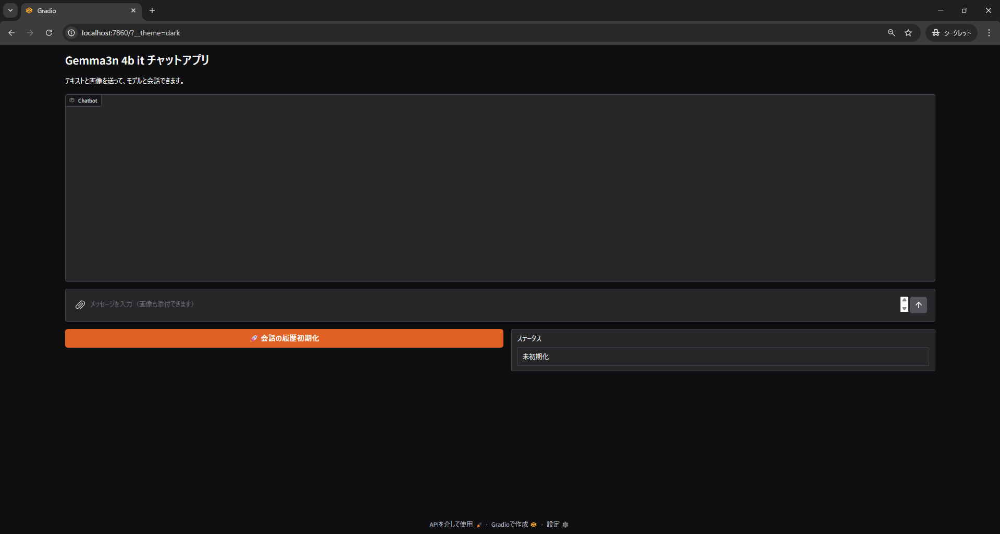
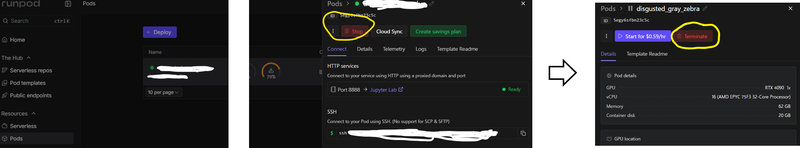
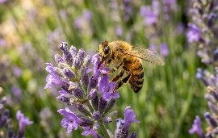

# Gemma3nChat
Gemma3n4bモデルを使ったChat


## 環境構築
環境構築に関しては下記の資料を参照。

[Runpod & 使用環境設定](RunpodENV.md)

## Gemma3n WEB APPを起動
下記のコマンドでChatアプリを起動します。
```
CUDA_VISIBLE_DEVICES=0 python vlm_chat_app.py
```
起動に成功すると、以下のような出力が表示されます。
```
/workspace# CUDA_VISIBLE_DEVICES=0 python vlm_chat_app.py
Loading checkpoint shards: 100%|██████████████████████████████████████████████████████████████████████████████████████████████████████████████████| 4/4 [00:30<00:00,  7.52s/it]
* Running on local URL:  http://0.0.0.0:7860
* To create a public link, set `share=True` in `launch()`.
```


起動後下記のURLにアクセスする。

[http://localhost:7860/?__theme=dark](http://localhost:7860/?__theme=dark)

下記のような画面にアクセスできれば起動成功です。




### Error Tips
下記のエラーが発生する場合があります。
```
Set TORCH_LOGS="+dynamo" and TORCHDYNAMO_VERBOSE=1 for more information


You can suppress this exception and fall back to eager by setting:
    import torch._dynamo
    torch._dynamo.config.suppress_errors = True

```
上記のエラーが出た場合は、下記のコマンドを実行後再度コードを実行する。
```
export TORCH_COMPILE_DISABLE=1
```
## ChatAPP使い方
基本的な使い方は、下記のとおりです。


画像に関してもドラックアンドドロップで読み込ませることができます。


## Runpod停止
Runpodは停止しないとお金がかかるので停止させます。加えて、使ったPodを停止しておいておくだけで、お金がかかるようなので、もう使う必要がない場合は、[Terminate]を押して完全削除しましょう。まとめると下記です。

* [Stop] -> これから再度Podを使う場合（ただ、Podを置いておくだけでお金がかかる。）
* [Terminate] -> もうPodを使わない場合（一切お金かからないです。）




## Tips

### 単体での動作確認
下記のコマンドでモデル単体で動かして動作確認することができます。

```
CUDA_VISIBLE_DEVICES=0 python main.py
```
コード内で下記の指示をモデルに入力しています。
```
"You are a helpful assistant."
"入力した画像について説明してほしいお"
```
入力画像は下記です。




出力例は下記
```
/workspace# CUDA_VISIBLE_DEVICES=0 python main.py
Loading checkpoint shards: 100%|██████████████████████████████████████████████████████████████████████████████████████████████████████████████████| 4/4 [00:02<00:00,  1.64it/s]
The following generation flags are not valid and may be ignored: ['top_p', 'top_k']. Set `TRANSFORMERS_VERBOSITY=info` for more details.
出力は👇
ピンク色のコスモスに、小さな黒と黄色のハチが止まっている写真です。コスモスの花びらは薄く、中心は黄色です。背景には緑の葉と、枯れたコスモスの花が見えます。右下には赤い花も少し見えています。

```
