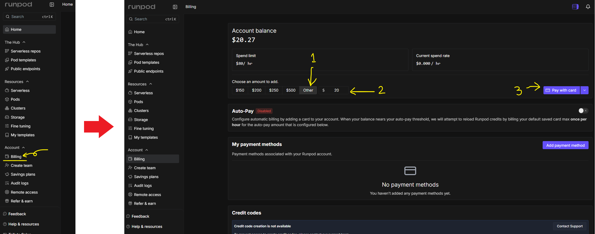
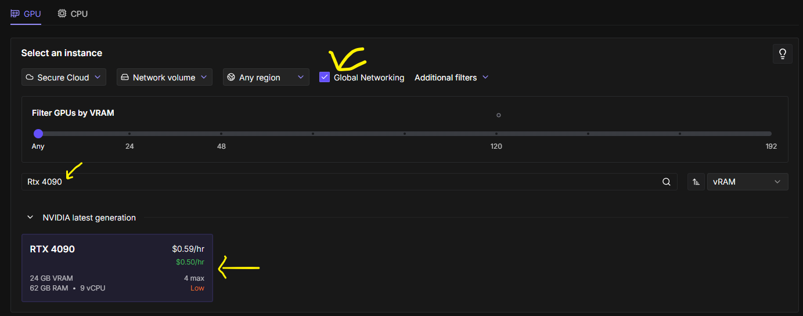
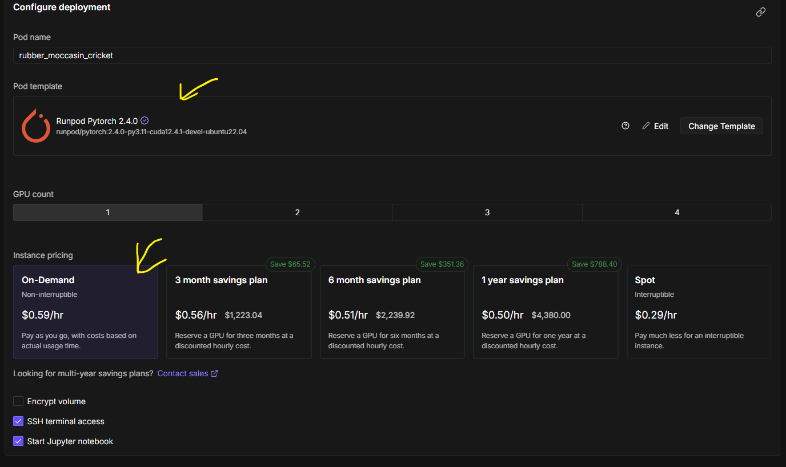
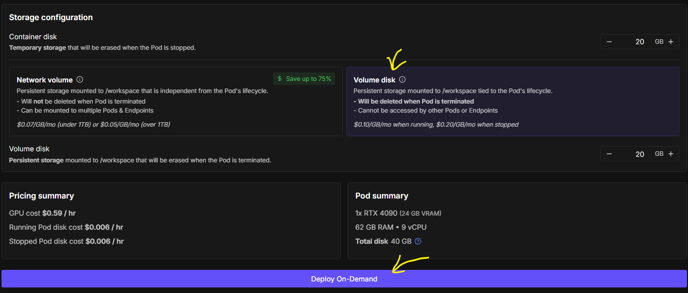

# 環境構築手順書

## 前提条件
私は個人なので主に下記の理由からRunPodを利用することにしました。

* GPUは非常に高額（例:RTX 4090などは100万円ほどする）
* 電力消費が家庭のコンセントからではギリ、もしくは足りない。

## Runpodとは？
Runpodは、GPUサーバーを手軽に借りられるクラウドサービス。機械学習やAI開発向けに、必要なときだけ高速GPU環境を使えるのが特徴。低コストで柔軟に使えるため、個人開発から研究用途まで幅広く使われているようです。Runpodの公式サイトは下記です。

[RunPod公式サイト](https://www.runpod.io/?pscd=get.runpod.io&ps_partner_key=NDNiMzk4ODE0NWMy&sid=1-b-77e6225cf34710fedd374b91da17556c&msclkid=77e6225cf34710fedd374b91da17556c&ps_xid=7A1xTSxKItZDze&gsxid=7A1xTSxKItZDze&gspk=NDNiMzk4ODE0NWMy)

## RunPodの設定
サイトを開いてSign Upします。

サインアップ後、利用料を前もって払います。今回はRTX 4090を使うので大体3000円くらい入れておけば大丈夫だと思われます。Billingをクリックして、課金をしてください。※下記画像1~3を参考に

## 使用の流れ
簡単な使用の流れは下記。
1. GPUやテンプレートを選ぶ

2. ストレージ環境を選ぶ

3. Podを起動

