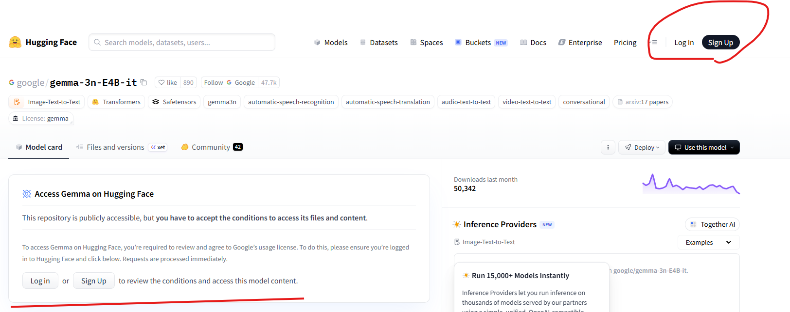
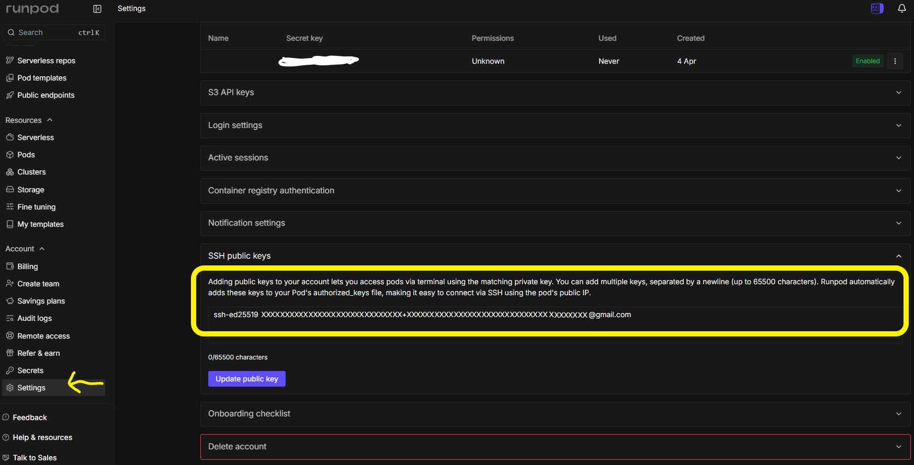
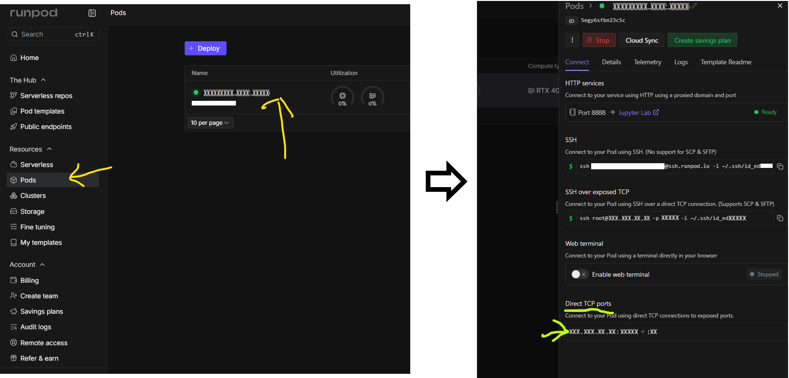
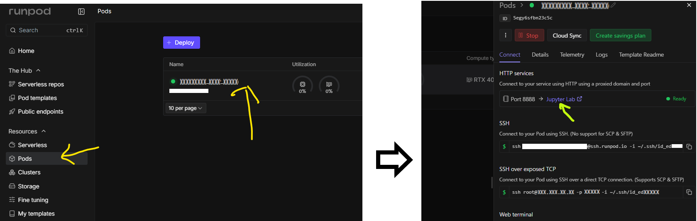
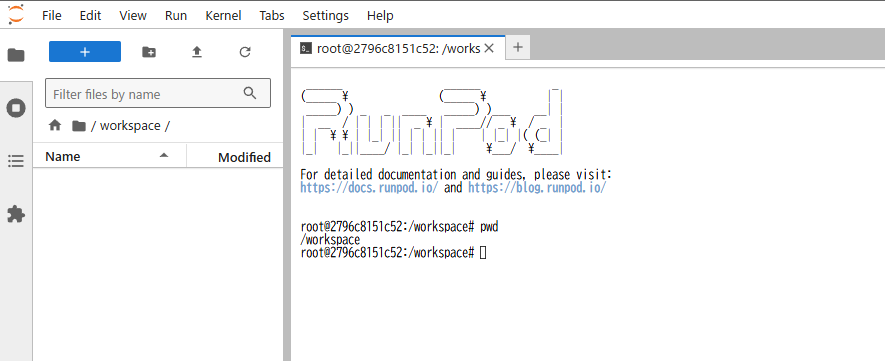
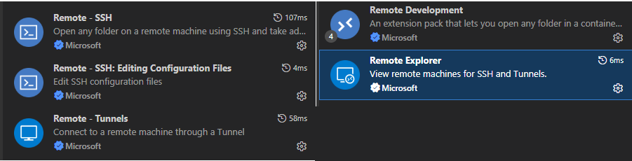
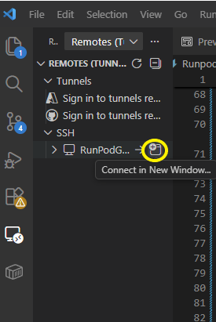
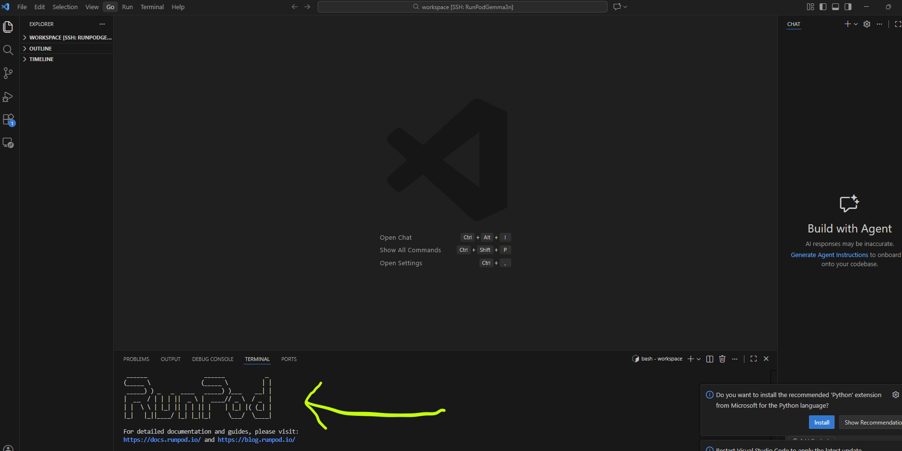

# Runpod & 使用環境設定
[READMEに移動](README.md)

## 動作確認条件
* GPU環境
    * Runpod
* 使用言語
    * Python
* 主な使用ライブラリ
    * pytoch 2.4.0
    * transformers 4.53.0
    * gradio 6.11.0
* 使用ツール
    * Vscode

## フォルダ構成
```
Gemma3nChat/
├── desc_img ------------> 説明画像
├── gradio_tmp ----------> gradioのキャッシュフォルダ
├── model_weights -------> モデルの保存フォルダ
├── bee.jpg -------------> 入力画像例
├── main.py -------------> モデルの実行テストコード
├── README.md -----------> 使い方資料
├── requirements.txt ----> 使用ライブラリ情報
├── RunpodENV.md --------> 環境構築資料
└── vlm_chat_app.py -----> CHATコード　
```

# ■ モデルの準備
今回使用する Gemma-3n-4bit モデルは利用許可が必要です。Sign inしてアクセス申請してください。



# ■ Runpodの初期設定
## Runpodを使う理由
私は個人なので主に下記の理由からRunpodを利用することにしました。

* GPUは非常に高額（例:RTX 4090などは100万円ほどする）
* 家庭用電源では電力が不足の可能性

## Runpodとは？
Runpod は GPU サーバーを手軽に借りられるクラウドサービスです。機械学習や AI 開発向けに、必要なときだけ高速 GPU 環境を利用できるのが特徴です。低コストで柔軟に使えるため、個人開発から研究用途まで幅広く使われているようです。

[Runpod公式サイト](https://www.runpod.io/?pscd=get.runpod.io&ps_partner_key=NDNiMzk4ODE0NWMy&sid=1-b-77e6225cf34710fedd374b91da17556c&msclkid=77e6225cf34710fedd374b91da17556c&ps_xid=7A1xTSxKItZDze&gsxid=7A1xTSxKItZDze&gspk=NDNiMzk4ODE0NWMy)


## Runpodの設定
サイトを開いてSign Upします。


サインアップ後、利用料金を事前にチャージします。今回は RTX 4090 を使用するため、目安として 3,000 円程度チャージしておくと安心です。Billing をクリックしてチャージしてください。※下記画像1~3を参考に


## 使用の流れ
簡単な使用の流れは以下のとおりです。

### 1. ssh keyの設定
ローカル PC で以下のコマンドを実行し、公開鍵（.pub）を作成します。
```
ssh-keygen -t ed25519 -C "your_email@example.com"
```
上記のコマンドを実行すると、指定した場所に .pub ファイルが生成されます。
```
例
C:\Users\xxxx\id_ed25519.pub
```
生成された .pub ファイルをテキストエディタで開き、中身をコピーします。
```                                          
ssh-ed25519 XXXXXXXXXXXXXXXXXXXXXXXXXXXXXXXX+xxxxxxxxxxxxxxxxxxxxx+xxxxxxxxxxxxx xxxxxxxxxx@gmail.com
```

コピーした内容をRunpodのページで登録する。[Settings]->[SSH public keys]でページを開き先ほどコピーした.pubファイルの中身をコピペする。




### 2. GPUやテンプレートを選ぶ


### 3. ストレージ環境を選ぶ


### 4. Podを起動


### 5. SSH接続情報をメモ
「Direct TCP ports」をメモする。



メモする内容例
```
ssh root@111.111.11.11 -p 22222 -i ~/.ssh/id_ed33333
```

これで Runpod 側の設定は完了です。

# 使用方法
使用方法は以下の 2 通りがあります。自分の好きなほうを使ってください。
* JupyterLabを利用して使用（最も手軽ですが、今回は使用しません）
* VscodeでSSH接続して使用（設定がやや複雑なため、今回はこちらを使用します）


# JupyterLabを利用して使用 
Vscodeを使いたくない場合はJupyterLabであれば追加の設定なしで利用できます。

[Pods] -> [立ち上げたPodをクリック] -> [JupyterLabをクリック]




下記のような画面が表示されれば成功。



# VscodeでSSH接続して使用
### 前提条件
* Vscodeがダウンロード済みであること。
* VS CodeでSSH接続環境が設定済みであること。（※下記追加拡張機能例）
    


### config 設定
config fileを開いて、**5. SSH接続情報をメモ**でメモした内容を記述する。
```
Host RunpodGemma3n
    HostName 111.111.11.11
    User root
    IdentityFile ~/.ssh/id_ed33333
    Port 22222
    IdentitiesOnly yes
```
※ファイルの場所例はー＞"C:\Users\xxxx\.ssh\config"

### Vscodeで開く
下記画像の黄色丸をクリックして接続する。
※ 下記はあくまで例です。各自読み替えてください。



### 接続確認
接続完了するとターミナルに下記のような表示が出る。
※Runpodと表示されていればOK



# コード・ライブラリ設定
## コードの格納

Runpod上のターミナルで下記のコマンドを実行する。
```
cd /workspace
```
移動したフォルダに Gemma3nChat 内のコードとフォルダを格納します。

格納後のフォルダ構成は下記のようになります。
```
/workspace/
├── desc_img ------------> 説明画像
├── gradio_tmp ----------> gradioのキャ
　・
　・
　・
└── vlm_chat_app.py -----> CHATコード　
```
## ライブラリのインストール
Runpod のターミナルで以下のコマンドを実行し、必要なライブラリをインストールします。
```
pip install --upgrade pip
pip install -U "huggingface_hub[cli]"
pip install -r requirements.txt
```

### HuggingFaceにログイン
手動でダウンロードして Runpod 上に配置する手間を省くため、コマンドで格納する。

HuggingFaceにターミナル上でログインする。
```
hf auth login
```
上記のコマンドを実行するとトークンを求められるのでHuggingFaceで設定した自分のトークンを設定します。
```
Enter your token (input will not be visible): 
```
今回は使用しないため、下記の質問は `n` を選択します。
```
Add token as git credential? [y/N]: n
```
これでログイン作業完了。

### HuggingFaceからモデルのダウンロード
Runpodのターミナル上で以下のコマンドでダウンロードを開始する。
```
cd /workspace
hf download google/gemma-3n-E4B-it --local-dir ./model_weights
```

ダウンロードが完了すると、フォルダ内に以下のファイルが格納されます。
```
/workspace/model_weights/
├── .gitattributes
├── README.md
　・
　・
　・
└── tokenizer_config.json
```

以上で環境構築は完了です。

[READMEに移動](README.md)
